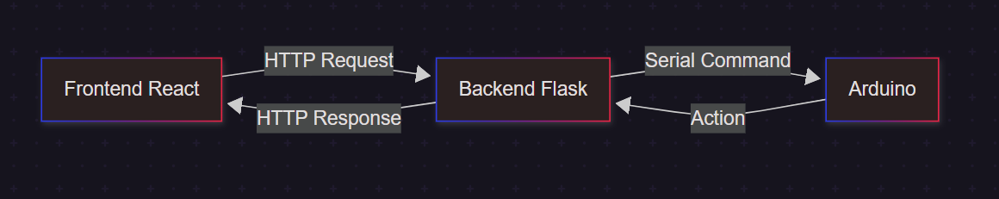

# 💊 ControlMed

📚 **[Acesse a documentação completa no GitBook](https://app.gitbook.com/o/JOLSSr7mpzIMl25heEI3/s/hpLd9RAZLPID0bwpwk1c/)**

Bem-vindo ao **ControlMed**, um sistema inteligente para controle e liberação de medicamentos com integração entre:

- Frontend moderno com **React + Tailwind CSS**
- Backend robusto com **Python Flask**
- Integração com **dispositivos IoT** como Arduino e Raspberry Pi

---
## Fluxo da aplicação


## 📑 Sumário

- [Funcionalidades principais](#funcionalidades-principais)
- [Instalação rápida](#instalação-rápida)
- [🚀 Explore mais](#-explore-mais)
- [Integrantes do Projeto](#integrantes-do-projeto)

---

## Funcionalidades principais

- Cadastro e agendamento de medicamentos
- Lembretes visuais e sonoros
- Acionamento de hardware no horário do remédio
- Interface web acessível e responsiva

---

## Instalação rápida

```bash
git clone https://github.com/seu-usuario/controlmed-app.git
cd controlmed-app/client
npm install
npm start
```
Certifique-se de que o backend está rodando em http://localhost:5000.

## 🚀 Explore mais

- **Como instalar e configurar:** Veja instruções detalhadas na [documentação do GitBook](https://app.gitbook.com/o/JOLSSr7mpzIMl25heEI3/s/hpLd9RAZLPID0bwpwk1c/instalacao).
- **Como a API funciona:** Exemplos de uso e endpoints disponíveis na seção de API do GitBook.
- **Resumo técnico completo:** Arquitetura, fluxos e integrações descritos na documentação.

---

## Integrantes do Projeto

| RA      | Nome                |
|---------|---------------------|
| 1134868 | Ábner Panazollo     |
| 1134433 | Ariel Diefenthaeler |
| 1135384 | Gabriel Onofre      |
| 1134933 | Eduardo Sichelero   |
| 1135046 | Enzo Schultz        |
| 1134821 | Vitor Quadros       |

---